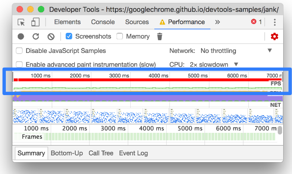
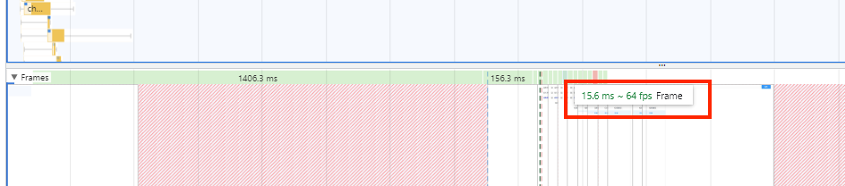
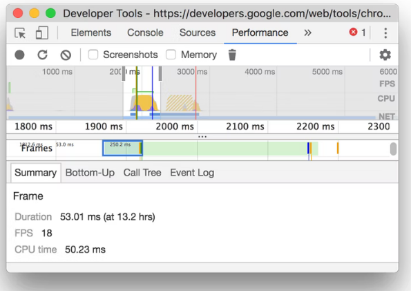
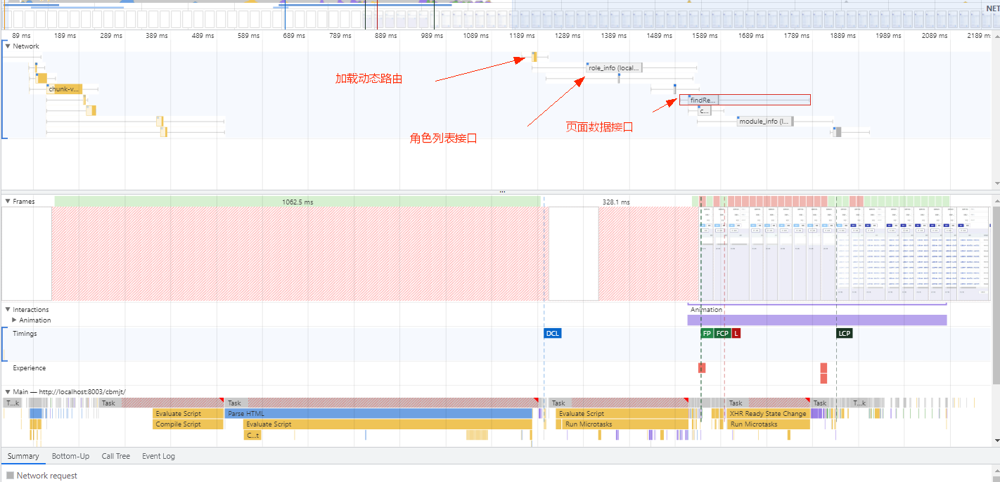

# 性能指标

## RAIL 性能模型

RAIL是Response，Animation，Idle和Load的首字母缩写，是一种由Google Chrome团队于2015年提出的性能模型，用于提升浏览器的用户体验和性能

RAIL模型的理念是以用户为中心，最终目标并不是让你的网站在任何特定设备上都能运行很快，而是使用户满意

**Response**

应该尽可能快速的响应用户的操作，应在在100ms以内响应用户输入

**Animation**

在展示动画的时候，每一帧应该以16ms进行渲染，这样可以保持动画效果的一致性，并且避免卡顿

**Idle**

当使用js主线程的时候，应该把任务划分到执行时间小于50ms的片段中去，这样可以释放线程以进行用户交互。50ms为单位是为了保证用户在发生操作的100ms内做出响应

要使网站响应迅速，动画流畅，通常都需要较长的处理时间，但以用户为中心来看待性能问题，就会发现并非所有工作都需要在响应和加载阶段完成，我们完全可以利用浏览器的空闲时间处理可延迟的任务，只要让用户感受不到延迟即可。利用空闲时间处理延迟可减少预加载的数据大小，以保证网站或应用快速完成加载

**Load**

应该在小于1s的时间内加载完成你的网站，并可以进行用户交互。根据网络条件和硬件的不同，用户对性能延迟的理解也有所不同，在3G网络需要花费更多的时间，5s是一个更现实的目标

## 重要的性能指标


**LCP (Largest Contentful Paint)**

最大内容绘制，可视区域中最大的内容元素呈现到屏幕上的时间，用以估算页面的主要内容对用户的可见时间。img图片，video元素的封面，通过url加载到的北京，文本节点等，为了提供更好的用户体验，网站应该在2.5s以内或者更短的时间最大内容绘制

| LCP时间(秒) | 颜色编码     |
| ---------- | -----------|
| 0 - 2.5    | 绿色(快)    |
| 2.5 - 4    | 橙色(中等)   |
| 超过4       | 红色(慢)    |

**FID (First Input Delay)**

首次输入延迟，从用户第一次与页面进行交互到浏览器实际能够响应该交互的时间，输入延迟是因为浏览器的主线程正忙于做其他事情，所以不能响应用户，发生这种情况的一个常见原因是浏览器正忙于解析和执行应用程序加载的大量计算的JavaScript

| FID时间(毫秒) | 颜色编码     |
| ----------- | -----------|
| 0 - 100     | 绿色(快)    |
| 100 - 300   | 橙色(中等)   |
| 超过300      | 红色(慢)    |

**TTI (Time to Interactive)**

网页第一次完全达到可交互状态的时间点，浏览器已经可以持续的响应用户的输入，完全达到可交互的状态的时间是在最后一个长任务完成的时间，并且在随后的5秒内网络和主线程是空闲的。从定义上来看，中文名称叫持续可交互时间或可流畅交互时间更合适

| TTI时间(秒)  | 颜色编码     |
| ----------- | -----------|
| 0 - 3.8     | 绿色(快)    |
| 3.9 - 7.3   | 橙色(中等)  |
| 超过7.3      | 红色(慢)   |

**TBT (Total Block Time)**

总阻塞时间，度量了FCP和TTI之间的总时间，在该时间范围内，主线程被阻塞足够长的时间以防止输入响应。只要存在长任务，该主线程就会被视为阻塞，该任务在主线程上运行超过50
毫秒。

线程阻塞是因为浏览器无法中断正在进行的任务，因此如果用户确实在较长的任务中间与页面进行交互，则浏览器必须等待任务完成才能响应。

| TBT时间(毫秒) | 颜色编码     |
| ----------- | -----------|
| 0 - 300     | 绿色(快)    |
| 300 - 600   | 橙色(中等)   |
| 超过600      | 红色(慢)    |

**CLS (Cumulative Layout Shift)**

累计布局便宜，CLS会测量在页面整个生命周期中发生的每个意外的布局移位的所有单独布局移位分数的总和，他是一种保证页面的视觉稳定性从而提升用户体验的指标方案。

用人话来说就是当我们想点击页面中的某个元素的时候，突然布局变了，手指点到了其它位置。比如想点击页面的链接，突然出现了一个banner。这种情况可能是因为尺寸未知的图像或者视频。

| CLS时间(毫秒) | 颜色编码     |
| ----------- | -----------|
| 0 - 0.1     | 绿色(快)    |
| 0.1 - 0.25  | 橙色(中等)   |
| 超过0.25     | 红色(慢)    |

## Web Vitals

这也是谷歌指定的web性能指标标准, 谷歌认为之前的标准太复杂，指标太多了，在2020年重新进行了梳理，简化到了三个。加载性能LCP，交互性FID，视觉稳定性CLS。只需要做好这三个，网站的性能基本上就可以了

- 加载性能LCP(Largest Contentful Paint)：可视区域中最大的内容元素呈现到屏幕上的时间，大致可以表示为页面全部加载完成时间

- 交互性FID(First Input Delay)：用户第一次与页面进行交互到浏览器实际能够响应该交互的时间

- 视觉稳定性(CLS (Cumulative Layout Shift)：发生的每个意外的布局移位的所有单独布局移位分数的总和

测量Web Vitals的工具有很多，比如Lighthouse, web-vitals, 浏览器插件web vitals。

**Web-Vitals**

```js
// npm install web-vitals -g

import { getLCP, getFID, getCLS } from 'web-vitals';

getCLS(conole.log)
getFID(conole.log)
getCLS(conole.log)
```

**浏览器插件**

谷歌浏览器可以直接在插件市场中查找并且安装web vitals。安装完成之后浏览器的右上角会多出插件标志，点击就会显示页面的性能指标。

## 性能测试

性能检测是作为性能优化过程中的一环，他的目的通常是给后续优化工作提供指导方向，参考基线以及千户对比的依据。性能检测并不是一次性执行结束后就完成的工作，他会在检测，记录和改进的迭代过程中不断重复。来协助网站的性能优化不断接近期望的效果

### Lighthouse（灯塔）

Lighthouse是谷歌开发并开源的web性能测试工具，用于改进网络应用的质量，可以将其作为一个Chrome扩展程序运行，或从命令行运行。只需要为其提供一个需要审查的地址，Lighthouse就会对页面进行一连串的测试，生成一个有关页面性能的报告

在浏览器的调试工具中默认就存在lighthouse选项，只需要切换至lighthouse, 在右侧的选项区选中我们需要的选项。点击生成报告

### WebPageTest

在线web性能测试工具((www.webpagetest.org)[www.webpagetest.org]), 提供多地点测试。他只能测试已经发布了的网站。输入需要测试的网页地址，点击start test按钮就开始测试了，可以选择测试地理位置，测试的浏览器等。

[前端性能优化指标 + 检测工具](https://juejin.cn/post/6974565176427151397)


## 刷新率 FPS

FPS(frames per second) 是页面每秒的刷新频率.  FPS 好坏衡量标准：

- fps = 60: 性能极佳

- fps < 24: 会让用户感觉到卡顿，因为人眼的识别主要是24帧

有三个地方可以查看刷新率：

1. 通过 FPS图表 可以了解整个记录过程中的FPS情况 

2. 使用 Frames面板  也可以查看特定帧的长度

3. 使用 FPS仪表盘 来实时估计页面运行时的FPS

### FPS 图表

FPS图表提供页面运行期间期间帧率的概览。 **绿色条越高，帧率越好、红色越深帧率越差**



### Frame 面板

Frames面板可以准确地告诉你一个特定的帧花费了多长时间，将鼠标移到某一个帧上面可以看到具体时间



悬浮框出现的信息 `15.6ms ~ 64 fps Frame`，解读为：

- 当前帧的持续时间为 `15.6ms`,即页面两次刷新之间间隔了 `15.6ms`

- `1000ms/15.6ms = 64.10 约等于 64 `

Frame 面板不同的颜色意思为：

- 白色：空白帧，当前页面没有变化

- 绿色： 按预期及时渲染

- 黄色： 渲染了部分视图。例如在滚动的时候可能会出现

- 红色：不能在合理的时间内渲染框架

点击某一帧下面 Summary 面板也可以呈现出一些信息



## DCL

DOM(DOMContentLoaded) 加载完成即触发，不用等页面资源加载。

DCL 测量浏览器准备好执行任何客户端脚本的时间点。用更专业的术语来说，DCL 是在网页加载过程中，浏览器已组装 DOM（文档对象模型）且没有样式表阻止执行 JavaScript 的时间

**FCP (First Contentful Paint)**

首次内容绘制，浏览器首次绘制来自DOM的内容的时间，内容必须包括文本，图片，非白色的canvas或svg，也包括带有正在加载中的web字体文本。这是用户第一次看到的内容

| FCP时间(秒) | 颜色编码     | FPC分数     |
| ---------- | -----------| ---------- |
| 0 - 2      | 绿色(快)    | 75 - 100   | 
| 2 - 4      | 橙色(中等)   | 50 - 74   | 
| 超过4       | 红色(慢)    |  0 - 49    |


如果想达到60帧的刷新率，就意味着javascript线程中每个任务的耗时，必须少于16ms，一个解决办法就是使用Web Worker，主线程只用于UI渲染，然后跟UI渲染不相干的任务，都放在Worker线程


# 性能检测工具

## Network-Timeline


- Queueing: 等待队列时间

- Stalled: 是浏览器得到要发出这个请求的指令到请求可以发出的等待时间，一般是代理协商、以及等待可复用的TCP连接释放的时间，不包括DNS查询、建立TCP连接等时间等

- DNS Lookup：DNS查询的时间，当本地DNS缓存没有的时候，这个时间可能是有一段长度的，但是比如你一旦在Host 中设置了 DNS，或者第二次访问，由于浏览器的DNS缓存还在，这个时间就为0了

- Initial connection：建立TCP连接的时间，就相当于客户端从发请求开始到 TCP 握手结束这一段，包括 `DNS查询+Proxy时间+TCP握手时间`

- Request sent： 请求第一个字节发出前到最后一个字节发出后的时间，也就是上传时间

- Waiting(TTFB)：请求发出后，到收到响应的第一个字节所花费的时间(Time To First Byte),发送请求完毕到接收请求开始的时间;这个时间段就代表服务器处理和返回数据网络延时时间了。服务器优化的目的就是要让这个时间段尽可能短。

- Content Download：收到响应的第一个字节，到接受完最后一个字节的时间，就是下载时间

## Performance-Network面板


### 颜色说明

不同的资源将以不同的颜色进行划分：

- HTML 文件为蓝色

- 脚本为黄色

- 样式表为紫色

- 媒体文件为绿色

- 其他资源为灰色

### 时间轴

时间轴的组成说明：

- 左边的线：request send前

- 浅色块： request send 和 waiting 时间

- 深色块： content download 时间

- 右边线： 等待主线程时间，不在Timing中显示

### Summary

我们点击 `app.js` 资源，下面的 `Summary` 将会出现对应的概览信息




https://juejin.cn/post/6844903839863144461#heading-21

