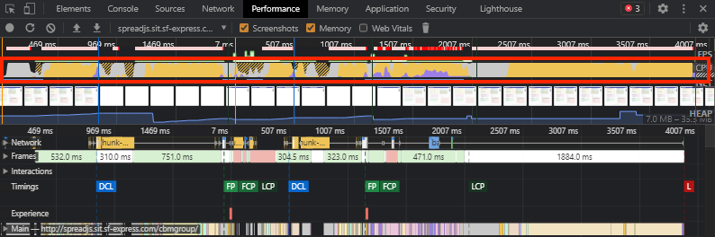
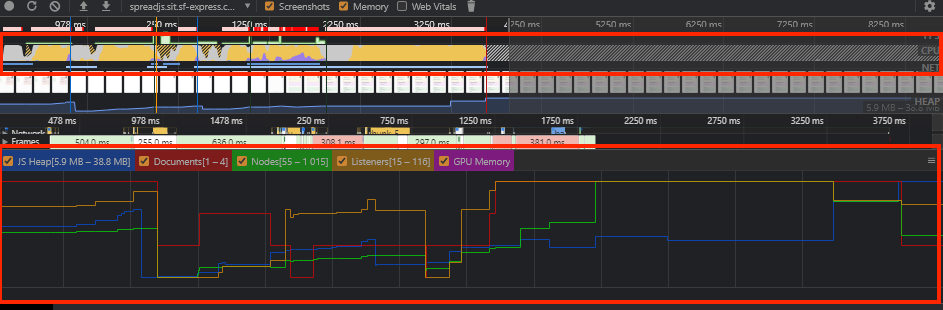
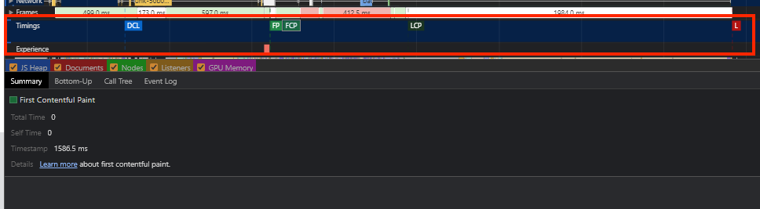
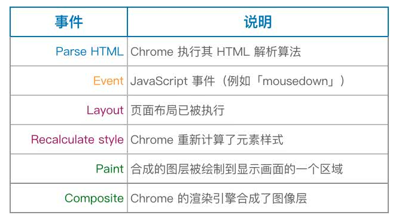
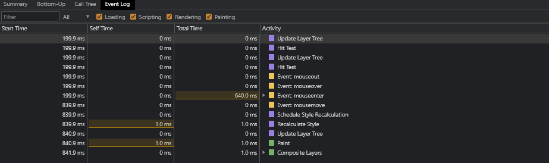

# 性能定位

**为什么要做前端性能优化？**

### 性能与转换率

```
票子：

AI 医疗保健软件公司 mPulse Mobile 的测试发现：

页面加载时间为 2.4 秒以内时，其转化率为 1.9％
3.3 秒时，转化率为 1.5％
4.2 秒时，转化率为不到 1.1％
超过 5.7 秒时，转化率为 0.6％


沃尔玛发现，页面加载时间每减少 1 秒，转化数就会增加 2％

COOK 通过将页面加载时间减少 0.85 秒，使转化数提高了 7％

Mobify 发现，首页加载时间每减少 100 毫秒，转化率就会提高 1.11％

```

### 性能与跳出率

47% 的客户希望网页在 2 秒或更短时间内完成加载

BBC发现，其网站加载时间每增加一秒，就会多流失10%的用户

## Performance 面板

通过 Performance 面板 可以网站运行期间任意时间段的性能情况，录制结束后会输出类似下面图示的结果：


介绍下从上往下看下各面板代表什么

### 整体概览


这里最主要是整体的界面渲染的时候，每个时间段执行的事件顺序，通过上图我们就能知道我们每个时间段大概做了什么，鼠标放上去可以看到我们每个时间段的界面渲染情况

如上图顶部区域所示，这部分展示了五个信息： FPS、CPU、NET、屏幕快照、HEAP

- FPS-刷新率
    
    FPS(frames per second) 是页面每秒的刷新频率.  FPS 好坏衡量标准：
    
    - fps = 60: 性能极佳
    
    - fps < 24: 会让用户感觉到明显卡顿，因为人眼的识别主要是24帧
    
    **所以为了让帧率尽可能保持在 60 帧率，意味着每一帧期间执行的任务时间需要控制在 `16ms` 之内**
    
    :::tip
    浏览器每帧要做的完整事情是：`JS（ 脚本执行） -> Style（样式计算） -> Layout（布局） -> Paint（重绘） -> Composite（合成）`
    :::
    
    > [浏览器的 16ms 渲染帧 DOM JavaScript 异步 性能 重绘 浏览器渲染](https://harttle.land/2017/08/15/browser-render-frame.html)
    
    
    

    如上图所示 FPS 图表页面运行期间期间帧率的概览。 由两部分组成：

    - 红色条： 当出现红色条时说明帧数已经下降到影响用户体验的程度，颜色越深说明帧数越差
    
    - 绿色的柱体：绿色条越高，帧率越好

- CPU

    
    
    上图中 FPS 下面的位置，即是 CPU 图表，可以看 CPU 图表被一些颜色填满，表示 CPU 正在处理某一类的任务，这些颜色对应于 “性能”工具底部摘要面板中的颜色
    
    - 紫色：渲染
    
    - 黄色：JS
    
    - 蓝色：加载
    
    - 绿色：绘制
    
    - 灰色：其它
    
    - 浅灰色：空闲
    
    **如果你看到了某个颜色占用了大量的时间，那么这很可能就是一个性能瓶颈的线索**

- NET
    
    
    
    每条横杆代表一种请求资源. 横杆越长，检索资源所需要的事件越长。每个横杆的浅色部分表示等待时间（请求资源到第一个字节下载完成时间）。
    
    HTML文件是蓝色、脚本是黄色、样式是紫色、媒体文件是绿色、其它资源是灰色
    
    这个地方只能看个大概，详细的还是直接看下面的 network 面板比较清楚

- HEAP
    
    
    
    这里展示的内存使用情况，如果反复切换同一页面，图表不断上升，说明可能存在内存泄漏问题
    
    `HEAP 图表` 提供的信息与 `memory 表` 中的 `JS Heap` 相同

### Network面板


在 NetWork 部分，可以查看录制期间发生的网络请求情况. 如图所示面板出现了几个类似时间轴的线条，每条时间轴表示一个网络请求

**颜色划分说明**

不同的资源将以不同的颜色进行划分：

- HTML 文件为蓝色

- 脚本为黄色

- 样式表为紫色

- 媒体文件为绿色

- 其他资源为灰色

**时间轴的组成说明：**

- 左边的线：request send 前

- 浅色块： request send 和 waiting 时间

- 深色块： content download 时间

- 右边线： 等待主线程时间，不在 Timing 中显示

**左上角的深蓝色方形意味着它是一个优先级较高的请求。 浅蓝色的方块表示优先级较低**

#### Net-Summary

我们点击某个时间轴下面的 `Summary` 将会出现对应的概览信息


#### Network-Timeline

结合 Network 里的  Timeline，可以得某个请求更多的信息


- Queueing: 等待队列时间

- Stalled: 是浏览器得到要发出这个请求的指令到请求可以发出的等待时间（不包括DNS查询、建立TCP连接等时间等）

- DNS Lookup：DNS查询的时间，当本地DNS缓存没有的时候，这个时间可能是有一段长度的，但是比如你一旦在Host 中设置了 DNS，或者第二次访问，由于浏览器的DNS缓存还在，这个时间就为0了

- Initial connection：建立TCP连接的时间，就相当于客户端从发请求开始到 TCP 握手结束这一段，包括 `DNS查询+Proxy时间+TCP握手时间`

- Request sent： 请求第一个字节发出前到最后一个字节发出后的时间，也就是上传时间

- Waiting(TTFB)：请求发出后，到收到响应的第一个字节所花费的时间(Time To First Byte),发送请求完毕到接收请求开始的时间;这个时间段就代表服务器处理和返回数据网络延时时间了。服务器优化的目的就是要让这个时间段尽可能短。

- Content Download：收到响应的第一个字节，到接受完最后一个字节的时间，就是下载时间


### Frame 面板

Frames 面板可以更准确地告诉你一个特定的帧花费了多长时间，将鼠标移到某一个帧上面可以看到具体时间


点击某一帧下面 Summary 面板也可以呈现出一些信息

悬浮框出现的信息 `69.0ms ~ 14 fps Frame`，解读为：

- 当前帧的持续时间为 `69.0ms`,即页面两次刷新之间间隔了 `69.0ms`

- `1000ms/69.0ms = 64.10 约等于 14 `

Frame 面板不同的颜色意思为：

- 白色：空白帧，当前页面没有变化

- 绿色： 按预期及时渲染

- 黄色： 渲染了部分视图。例如在滚动的时候可能会出现

- 红色：不能在合理的时间内渲染框架


### Timings 面板

如果是从 Lighthouse 跳过来的 会有 `Timings 面板`



Timings 面板标注了性能指标相关的的完成节点，点击各个节点下面 Summary 也会显示具体的信息. 接下说明一个这些节点各自表示什么：

- DCL(DOMContentLoaded)： 加载完成即触发，不用等页面资源加载

  DCL 测量浏览器准备好执行任何客户端脚本的时间点。用更专业的术语来说，DCL 是在网页加载过程中，浏览器已组装 DOM（文档对象模型）且没有样式表阻止执行 JavaScript 的时间

- FP（First Paint）：表示渲染出第一个像素点。FP一般在HTML解析完成或者解析一部分时候触发

- FCP (First Contentful Paint)：首次内容绘制

  浏览器首次绘制来自DOM的内容的时间，内容必须包括文本，图片，非白色的canvas或svg，也包括带有正在加载中的web字体文本。这是用户第一次看到的内容

    | FCP时间(秒) | 颜色编码     | FPC分数     |
    | ---------- | -----------| ---------- |
    | 0 - 2      | 绿色(快)    | 75 - 100   | 
    | 2 - 4      | 橙色(中等)   | 50 - 74   | 
    | 超过4       | 红色(慢)    |  0 - 49    |


  如果想达到 60帧 的刷新率，就意味着 javascript 线程中每个任务的耗时，必须少于 16ms ，一个解决办法就是使用 Web Worker，主线程只用于UI渲染，然后跟UI渲染不相干的任务，都放在 Worker 线程

- LCP（largest contentful Paint）：最大内容渲染时间

- L（Onload Event）: 加载事件

### Experience 面板


这部分目测是根 CLS 相关，面板会告诉我们什么时候是否有发生 `布局偏移`.

图中的红色方块就表示发生了布局偏移，点击色块下面的 Summary 面板会显示具体的偏移信息

:::tip
[累积布局偏移 (CLS)](https://web.dev/cls/?utm_source=devtools) 是测量视觉稳定性的一个以用户为中心的重要指标，因为该项指标有助于量化用户经历意外布局偏移的频率，较低的 CLS 有助于确保一个页面是令人愉悦的。
:::

### Main 面板


这部分就是火焰图了，这里展示了一段时间内主线程上活动的任务信息

-  x 轴表示一段时间内的记录。 每个条形表示一个事件

- 宽条表示该事件花费了更长的时间

- Y 轴表示调用堆叠。 当事件堆叠在一起时，这意味着上面的事件调用了下面的事件，也就是执行栈

- 面板中会有很多的 Task，如果是耗时长的 Task，其右上角会标红

- 我们可以选中标红的 Task，然后放大，看其具体的耗时点

- 放大后，这里可以看到都在做哪些操作，哪些函数耗时了多少 
  
里面显示的代码是压缩后的，所以看到的也是压缩后的函数名。然后我们点击一下某个函数，在面板最下面，就会出现代码的信息，是哪个函数，耗时多少，在哪个文件上的第几行等。这样我们就很方便地定位到耗时函数了

同时也可以查看 Main 指标分析代码里面是否存在强制同步布局等操作，分析出来这些原因之后，我们可以有针对性地去优化我们的程序

**活动颜色**



[性能功能参考](https://docs.microsoft.com/zh-cn/microsoft-edge/devtools-guide-chromium/evaluate-performance/reference)

#### Main 概览

点击某个具体的活动可以在底部概览区域看到更多的相关信息，如执行时间、所处文件等，通过 `Bottom-Up`、 `call-tree`、 `Event Log` 等内容可以找到具体的执行栈调用过程中子函数的调用耗时情况


### 内存面板

打开 Chrome 控制台后，按组合键 ctrl + p(Mac 快捷键为 command + p)，输入> Show Performance Monitor，就可以打开 Performance Monitor 性能监视器。主要的监控指标包括：

- CPU usage：CPU 占用率

- JS head size：JS 内存使用大小

- DOM Nodes：内存中挂载的 DOM 节点个数

- JS event listeners：事件监听数


通过该图可以看出我们在不同的时间段的执行情况。我们可以看到页面中的内存使用的情况，比如 JS Heap(堆)，如果曲线一直在增长，则说明存在内存泄露，如果相当长的一段时间，内存曲线都是没有下降的，这里是有发生内存泄露的可能的

### 底部数据面板

**Summary**

统计面板选择因点击选择不同的目标统计的内容不同

- 未选择任何目标时

    
    
    可以得到某一时间段各类事件的活动占比，从这个例子可以看到主要是在执行 JS

- 选择具体目标时

  

  如图选择了具体目标时，比如 Main 中的某个函数，而显示该函数及期调用子函数的执行时等信息

**Bottom-Up**

此视图可以看到某些函数对性能影响最大，并能够检查这些函数的调用路径

Bottom-Up 有三个标签 `Self Time` 和 `Total Time` 以及 `Activity`

- Self Time: 函数本身执行消耗时间

- Total Time: 函数本身消耗再加上在调用它的函数中消耗的总时间

- Activity：至底向上展示活动的事件，类似事件冒泡的感觉，不断展开会发现最后一个就是根活动事件

  
  
  

  这里的 Group 面板非常有用。我们可以很清晰明了得分析按照活动，目录，域，子域，URL和Frame进行分组的前端性能。对于开发非常有帮助

  上图的例子可以发现 Activity 展开后跟上面的 Main 某个任务是能匹配上的

**Call Tree**

Call Tree 其实跟 Bottom-Up 差不多的，只是它呈现的活动是至项向下


可以看到跟 Bottom-Up 的例子是一样的

**Event Log：事件日志**

展示所有阶段包括 `loading`、 `javascripting`、`rendering`、`painting` 中各事件的耗时情况，并提供了 `filter ` 输入框和按钮供你快速过滤

- `start time`： 列表示活动开始时与录制开始相对的点。 例如，上图中所选项目 175.7 ms 的开始时间意味着录制开始 175.7 毫秒后活动开始。

- `self time`: 自身活动所用时间

- `total time`: 自身活动+其子活动总共执行时间



其实这四个标签要表现的东西是差不多的，只是呈现方式不一样

[网页性能工具——performance](https://zhangjiali0627.github.io/js/2020-06-20/WebPerformance.html)

### 查看代码覆盖率

我们可以打开 Chrome Devtool Coverage 面板，查看当前使用资源的代码覆盖率，红色表示未使用到的代码


[使用 Lighthouse 分析前端性能](https://zhuanlan.zhihu.com/p/376925215)

[Chrome运行时性能瓶颈分析](https://juejin.cn/post/6844903839863144461#heading-8)

[chrome-performance页面性能分析使用教程](https://codeantenna.com/a/t5fFJzavR3)

## 页面加载性能 Lighthouse


lighthouse 是 Google Chrome 推出的一款开源自动化工具，它可以搜集多个现代网页性能指标，分析 Web 应用的性能并生成报告，为开发人员进行性能优化的提供了参考方向

点击 `Generation Report` 后就可以等待分析结果，如果下图


### 指标权重

从 [Lighthouse Scoring Calculator](https://googlechrome.github.io/lighthouse/scorecalc/#FCP=0&SI=0&FMP=0&TTI=0&FCI=0&LCP=0&TBT=0&CLS=0&device=desktop&version=8) 可以看到 lighthouse  提供的几个性能评估指标：


Lighthouse 最新版的提供了 6 个性能指标：FCP、SI、LCP、TTI、TBT 和 CLS；权重分别是 15%，15%，25%，15%，25% 和 5%。Lighthouse 会根据权重计算得到一个分数值

### 优化建议


往下移可以看到报告给了优化建议，可以作为我们优化参数方向

点击 `View Original trace` 会跳转 Performance 面板，可看页面加载过程的运行情况

## 粟子

### 粟子一


页面显示的时候出现很长的一段空白，从 Performance 报告中可以发现帖刷新出现了很长的阻塞情况


在 Frame 面板点击红色的帧，可以发现此帧阻塞了 7s 多


在 Main 面板查看期间的活动情况，发现有一个活动 `updateAllZIndex` 执行非常长，慢的原因基本可以确定就是这方法引起的

`updateAllZIndex` 是一个重置页面绘图层级的方法，估计是遍历的时候给每个图层修改的层级时都不断得触发的绘制工作，所以修改层级的逻辑，在绘图之前就设置好各个图像的层级

[comment]: <> (![]&#40;./static/demo-1-4.png&#41;)

优化后缩短至了 2s 多，根据这个思路，可以继续往下优化 initNode 和 fadeInNodes 方法

#### 查看 Summary

如果未选择任何事件， Summary 面板将显示当前所选范围期间活动的事项


如图选取一个 FPS 飘红比较多地方，然后得到一个信息在  `3.03 s – 4.09 s` 期间，各类事件的活动占比，可以看到主要是在执行 JS

#### 查看 Main

接着上面的步骤，展开 Main 面板，就可以看 `3.03 s – 4.09 s` 期间具体做了哪些事情

重点关注动画帧触发事件右上角的红色三角形。 每当显示红色三角形时，都会显示一个警告，指出可能存在与事件相关的问题

单击某个具体的事件。 Summary 面板现在将显示有关该事件的信息。 同时将显示源代码中的相关行，点击源码路径就可以具体查看对应在代码了


### 粟子二


问题定位：

1. 火焰图：可以定位到一直在重复执行某类的方法（应该出现了遍历工作）

2. buttom-up:  `defineReative$$q` 在当前时间内占用了 20%的执行时间，`defineReative$$q` 是 vue 中的源码，可以判定是组件 `data` 出现了非常大的属性

### 粟子三


问题定位：

1. CPU一直做渲染工作

2. 问题可能是要渲染的节点太多了


## 如果规避问题

[分析运行时性能](https://docs.microsoft.com/zh-cn/microsoft-edge/devtools-guide-chromium/rendering-tools/)

[Chrome 调试面板](https://zhaoluting.gitbooks.io/chrome/content/panel/application.html)
