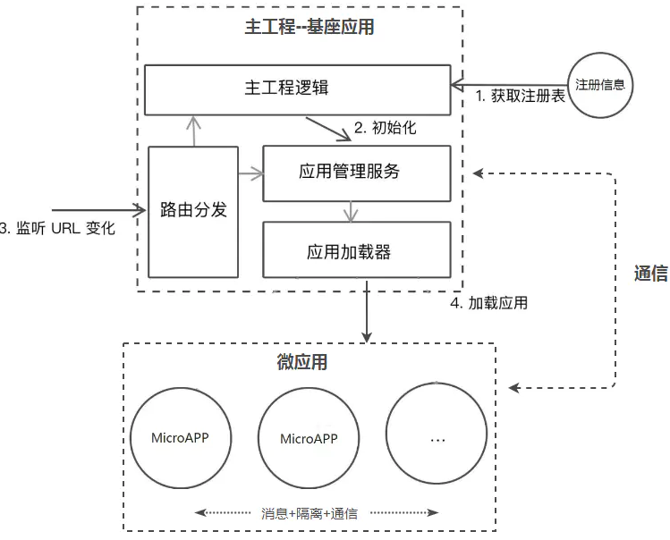
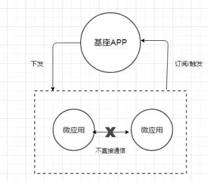

# 微前端

## 方案

微前端的重要思想就是将应用进行拆解和整合，通常是一个父应用加上一些子应用，那么使用类似Nginx配置不同应用的转发，或是采用iframe来将多个应用整合到一起等等这些其实都属于微前端的实现方案，下面是收集到的方案

### Nginx路由转发

通过Nginx配置反向代理来实现不同路径映射到不同应用，例如www.abc.com/app1对应app1，www.abc.com/app2对应app2，这种方案本身并不属于前端层面的改造，更多的是运维的配置

**优点**

简单，快速，易配置

**缺点**

在切换应用时会触发浏览器刷新，影响体验

### iframe嵌套

父应用单独是一个页面，每个子应用嵌套一个iframe，父子通信可采用 `postMessage` 或者 `contentWindow` 方式

**优点**

实现简单，子应用之间自带沙箱，天然隔离，互不影响

**缺点**

iframe的样式显示、兼容性等都具有局限性；太过简单而显得low

### Web Components

每个子应用需要采用纯Web Components技术编写组件，是一套全新的开发模式

**优点**

每个子应用拥有独立的script和css，也可单独部署

**缺点**

对于历史系统改造成本高，子应用通信较为复杂易踩坑

### 组合式应用路由分发

每个子应用独立构建和部署，运行时由父应用来进行路由管理，应用加载，启动，卸载，以及通信机制

**优点**

纯前端改造，体验良好，可无感知切换，子应用相互隔离

**缺点**

需要设计和开发，由于父子应用处于同一页面运行，需要解决子应用的样式冲突，变量对象污染，通信机制等技术点

目前已有的微前端框架

- Mooa：基于Angular的微前端服务框架

- Single-Spa：最早的微前端框架，兼容多种前端技术栈。

- Qiankun：基于Single-Spa，阿里系开源微前端框架。

- Icestark：阿里飞冰微前端框架，兼容多种前端技术栈。

- Ara Framework：由服务端渲染延伸出的微前端框架。

## 架构

当下微前端主要采用的是组合式应用路由方案，该方案的核心是“主从”思想，即包括一个基座（MainApp）应用和若干个微（MicroApp）应用，基座应用大多数是一个前端SPA项目，主要负责应用注册，路由映射，消息下发等，而微应用是独立前端项目，这些项目不限于采用React，Vue，Angular或者JQuery开发，每个微应用注册到基座应用中，由基座进行管理，但是如果脱离基座也是可以单独访问，基本的流程如下图所示：

	
**基座**

基座是应用中有一些菜单项，点击每个菜单项可以展示对应的微应用，这些应用的切换是纯前端无感知的，所以，基于目前的方案来说，一个微前端的基座框架需要解决以下问题：

- 路由切换的分发问题。

- 主微应用的隔离问题。

- 通信问题
	
	
### 微前端的路由分发

作为微前端的基座应用，是整个应用的入口，负责承载当前微应用的展示和对其他路由微应用的转发，对于当前微应用的展示，一般是由以下几步构成：

1. 作为一个SPA的基座应用，本身是一套纯前端项目，要想展示微应用的页面除了采用iframe之外，要能先拉取到微应用的页面内容， 这就需要远程拉取机制

2. 远程拉取机制通常会采用fetch API来首先获取到微应用的HTML内容，然后通过解析将微应用的JavaScript和CSS进行抽离，采用eval方法来运行JavaScript，并将CSS和HTML内容append到基座应用中留给微应用的展示区域，当微应用切换走时，同步卸载这些内容，这就构成的当前应用的展示流程
   
3. 当然这个流程里会涉及到CSS样式的污染以及JavaScript对全局对象的污染，这个涉及到隔离问题会在后面讨论，而目前针对远程拉取机制这套流程，已有现成的库来实现，可以参考 `import-html-entry` 和 `system.js`

对于路由分发而言，以采用vue-router开发的基座SPA应用来举例，主要是下面这个流程：

1. 当浏览器的路径变化后，vue-router会监听hashchange或者popstate事件，从而获取到路由切换的时机

2. 最先接收到这个变化的是基座的router，通过查询注册信息可以获取到转发到那个微应用，经过一些逻辑处理后，采用修改hash方法或者pushState方法来路由信息推送给微应用的路由，微应用可以是手动监听 `hashchange` 或者 `popstate` 事件接收，或者采用 React-router，vue-router 接管路由，后面的逻辑就由微应用自己控制

### 微前端的应用隔离

应用隔离问题主要分为主应用和微应用，微应用和微应用之间的JavaScript执行环境隔离，CSS样式隔离，我们先来说下CSS的隔离

**CSS隔离：**

当主应用和微应用同屏渲染时，就可能会有一些样式会相互污染，如果要彻底隔离CSS污染，可以采用CSS Module 或者命名空间的方式，给每个微应用模块以特定前缀，即可保证不会互相干扰，可以采用webpack的postcss插件，在打包时添加特定的前缀

而对于微应用与微应用之间的CSS隔离就非常简单，在每次应用加载时，将该应用所有的link和style 内容进行标记。在应用卸载后，同步卸载页面上对应的link和style即可

**JavaScript隔离:**

每当微应用的JavaScript被加载并运行时，它的核心实际上是对全局对象Window的修改以及一些全局事件的改变，例如jQuery这个js运行后，会在Window上挂载一个window.$对象，对于其他库React，Vue也不例外。为此，需要在加载和卸载每个微应用的同时，尽可能消除这种冲突和影响，最普遍的做法是采用沙箱机制（SandBox）

沙箱机制的核心是让局部的JavaScript运行时，对外部对象的访问和修改处在可控的范围内，即无论内部怎么运行，都不会影响外部的对象。通常在Node.js端可以采用vm模块，而对于浏览器，则需要结合with关键字和window.Proxy对象来实现浏览器端的沙箱

### 微前端的消息通信

应用间通信有很多种方式，当然，要让多个分离的微应用之间要做到通信，本质上仍离不开中间媒介或者说全局对象。所以对于消息订阅（pub/sub）模式的通信机制是非常适用的，在基座应用中会定义事件中心Event，每个微应用分别来注册事件，当被触发事件时再有事件中心统一分发，这就构成了基本的通信机制，流程如下图：

## qiankun

通过[qiankun](https://qiankun.umijs.org/zh)的使用，先来实现一个微服务demo

### 注意点

注意微项目的挂载节点不要与主容器的挂载节点相同。假如在主容器应该中我们的挂在 `#app` 节点中，那么微项目的挂载的节点不能也是 `#app`，要不然会被覆盖 

> [微前端-最容易看懂的微前端知识](https://juejin.cn/post/6844904162509979662)