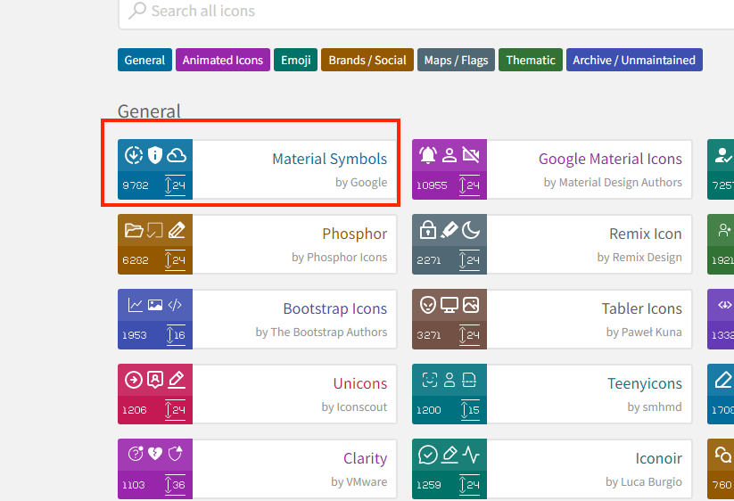
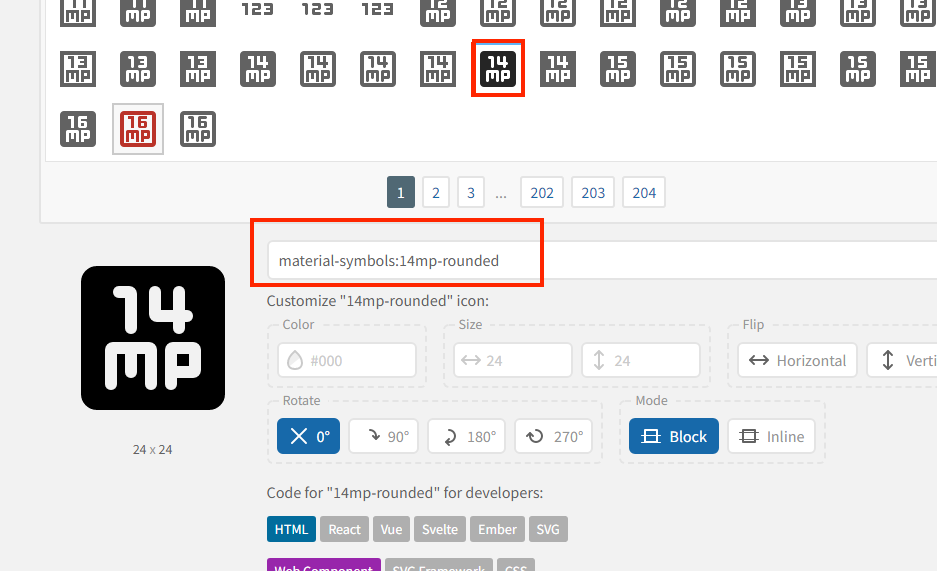

# 自动引入组件和ICON

当前配置例子以 Vue3(webpack) 为例

## 自动引入icon 

自动引入收录到 [iconify](https://icon-sets.iconify.design/) 中的图标

### 首页 Webpack 配置

```js
const { defineConfig } = require('@vue/cli-service')
const Icons = require('unplugin-icons/webpack')
const IconsResolver = require('unplugin-icons/resolver')
const Components = require('unplugin-vue-components/webpack')
module.exports = defineConfig({

  configureWebpack: {
    plugins: [
      Components({
        resolvers: [
          // 自动注册图标组件
          IconsResolver({
            // 使用element-plus的图标库
            // 其他图标库请到 https://icon-sets.iconify.design/
            enabledCollections: ['ep', 'carbon'],
            prefix: 'icon',
          }),
        ],
      }),
      Icons({
        autoInstall: true,
        compiler: 'vue3'
      }),
    ]
  },

})

```

### 查找图标

前往 [iconify](https://icon-sets.iconify.design/) 查找图片

假如我想用这个 `Material Symbols` 里的图标



然后随便选一个图片，底部会出现图标信息



注意这个图片的名称为 `material-symbols:14mp-rounded`，冒号前表前的图标集，冒号后表示图标名，这个图标信名称是需要配置到 Webpack 中的，如下：

```js
 resolvers: [
    // 自动注册图标组件
    IconsResolver({
      // 使用element-plus的图标库
      // 其他图标库请到 https://icon-sets.iconify.design/
      enabledCollections: ['ep', 'carbon', 'material-symbols'], // 添加 material-symbols
      prefix: 'icon',
    }),
  ],
```

### 使用图标

然后就可以在项目中使用的，使用的规则为：[prefix]-图标集名称-图标名. 如要使用上面图标时代码就写为： `icon-material-symbols-14mp-rounded`

```vue
  <icon-material-symbols-14mp-rounded></icon-material-symbols-14mp-rounded>
```


## 自动化引入 Vue 常用的 api

```js
const path = require('path')
const { defineConfig } = require('@vue/cli-service')
const Components = require('unplugin-vue-components/webpack')
const { ElementPlusResolver }  = require('unplugin-vue-components/resolvers')
const pathSrc = path.resolve(__dirname, 'src')

module.exports = defineConfig({
  configureWebpack: {
    plugins: [
      AutoImport({
        // 自动导入 Vue 相关函数，如：ref, reactive, toRef 等
        imports: ['vue'],
        // 自动导入 Element Plus 相关函数，如：ElMessage, ElMessageBox... (带样式)
        resolvers: [
          ElementPlusResolver(),
        ],
        dts: path.resolve(pathSrc, 'auto-imports.d.ts'),
        // eslint报错解决
        eslintrc: {
          enabled: true, // Default `false`
          // filepath: './.eslintrc-auto-import.json', // Default `./.eslintrc-auto-import.json`
          // globalsPropValue: true, // Default `true`, (true | false | 'readonly' | 'readable' | 'writable' | 'writeable')
        },
      }),
      Components({
        resolvers: [
          // 自动导入 Element Plus 组件
          ElementPlusResolver(),
        ],
      }),
    ]
  },

})

```

### TS 类型处理

上面配置，项目运行后将在 src 目录下生成一个 `auto-imports.d.ts` 文件，将这个文件配置到 `tsconfig.json` 的 `exclude`

```json
// tsconfig.json
{
  "compilerOptions": {
    "target": "esnext",
    "module": "esnext",
    "strict": true,
    "jsx": "preserve",
    "moduleResolution": "node",
    "skipLibCheck": true,
    "esModuleInterop": true,
    "allowSyntheticDefaultImports": true,
    "forceConsistentCasingInFileNames": true,
    "useDefineForClassFields": true,
    "sourceMap": true,
    "baseUrl": ".",
    "types": [
      "webpack-env"
    ],
    "paths": {
      "@/*": [
        "src/*"
      ]
    },
    "lib": [
      "esnext",
      "dom",
      "dom.iterable",
      "scripthost"
    ]
  },
  "include": [
    "src/**/*.ts",
    "src/**/*.tsx",
    "src/**/*.vue",
    "tests/**/*.ts",
    "tests/**/*.tsx",
    "./src/auto-imports.d.ts"
  ],
  "exclude": [
    "node_modules"
  ]
}

```

### 处理 eslint 提示

上面有个 `eslintrc` 配置，项目运行后将在目录下自动生成一个 `.eslintrc-auto-import.json` 文件

然后在 `.eslintrc.js` 文件中配置上面成的文件名

```js
// .eslintrc.js
module.exports = {
  root: true,
  env: {
    node: true
  },
  'extends': [
    'plugin:vue/vue3-essential',
    'eslint:recommended',
    '@vue/typescript/recommended',
    '.eslintrc-auto-import.json'
  ],
  parserOptions: {
    ecmaVersion: 2020
  },
  rules: {
    'no-console': process.env.NODE_ENV === 'production' ? 'warn' : 'off',
    'no-debugger': process.env.NODE_ENV === 'production' ? 'warn' : 'off'
  }
}

```

这样项目就是可以直接 vue 的 api 了

## 自动引入 ElementUI 之后，如何进行进行样式覆盖

[通过 SCSS 变量](https://element-plus.gitee.io/zh-CN/guide/theming.html#%E9%80%9A%E8%BF%87-scss-%E5%8F%98%E9%87%8F) 进行样式覆盖

1. 新建 `element-cover.scss` 文件

  ```scss
    @forward '~element-plus/theme-chalk/src/common/var.scss' with (
        $colors: (
            'primary': (
            'base': green,
          ),
        ),
    );
  ```
  `@forward` 语句可以引入另一个模块的所有变量、mixins和函数，将它们直接作为当前模块的 API 暴露出去，而不会真的在当前模块增加代码，而添加 通过 `with` 函数可以改变模块内部变量的初始值

2. 配置 vue.config.js

    ```js
    const path = require('path')
    const { defineConfig } = require('@vue/cli-service')
    const AutoImport = require('unplugin-auto-import/webpack')
    const Components = require('unplugin-vue-components/webpack')
    const ElementPlus = require('unplugin-element-plus/webpack')
    const { ElementPlusResolver }  = require('unplugin-vue-components/resolvers')
    
    module.exports = defineConfig({
      transpileDependencies: true,
      css: {
        loaderOptions: {
          scss: {
            additionalData: `@use "src/assets/styles/element-ui/element-cover.scss" as *;`,
          },
        },
      },
      configureWebpack: {
        plugins: [
          AutoImport({
            // 注意要添加  importStyle 属性，表示 Element 样式引入方式
            resolvers: [
              ElementPlusResolver({ importStyle: "sass" }),
            ],
          }),
          Components({
            resolvers: [
              // 注意要添加  importStyle 属性，表示 Element 样式引入方式
              ElementPlusResolver({ importStyle: "sass" }),
            ],
          }),
          ElementPlus({
            useSource: true,
          }),
        ]
      },
    
    })
    ```
   
`css.loaderOptions.scss.additionalData` 表示通过给各个 scss 文件头部添加一条导包语句，进而实现将预置好的 scss 变量引入到每个 scss 文件的目的

配置完之后项目中也不需要手动引入 `element-cover.scss` 文件

也就意味着项目中所有的 scss 文件可以直接直接使用 `element-cover.scss` 中的变量，**包括 vue 文件中 `lang=scss` 中的样式**

:::tip
style-resources-loader 的配置会与上面的配置冲突，他们功能类似，所以可以不用配置 style-resources-loader
:::
