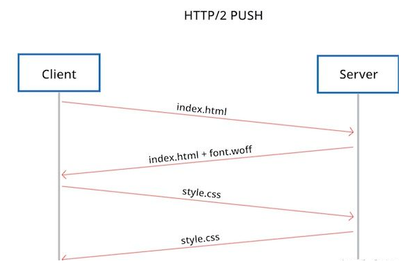
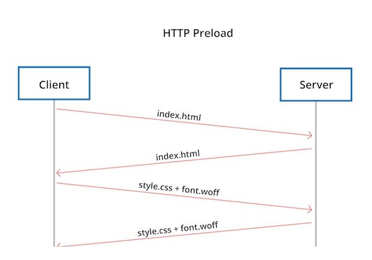
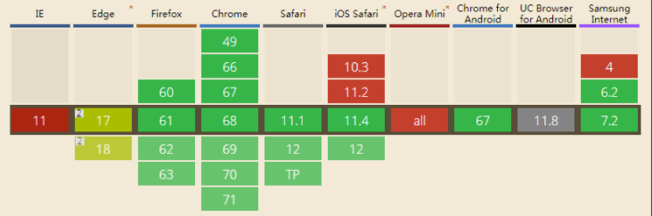
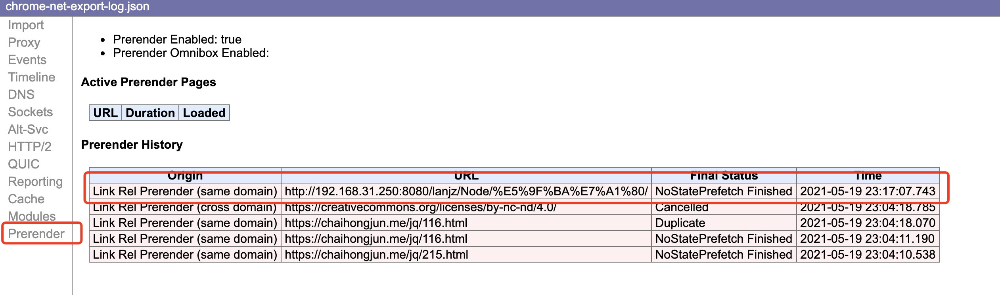
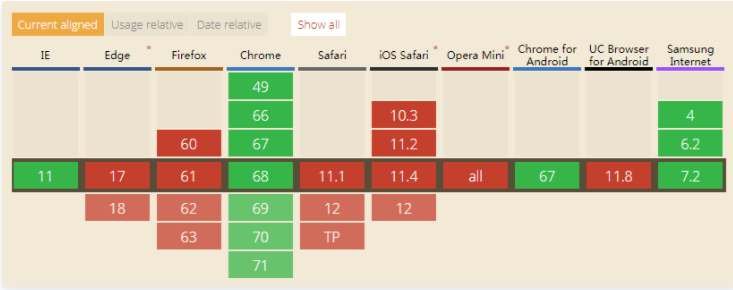

# 预加载&预解析

`link` 标签的 `rel` 添加了以下值来提示预加载&预解析行为：

- preload

- prefetch

- dns-prefetch

- prerender

- preconnect

## Preload&Prefetch

Preload 使用：

```html
<!--preload-->
<link rel="preload" href="style.css" as="style"> <!--提前下载，将内容存入缓存-->
<link rel="preload" href="main.js" as="script"> <!--提前下载，将内容存入缓存-->
<!--其它内容-->
<link rel="stylesheet" href="style.css" <!--从缓存中获取-->
```

Prefetch 使用：

```html
<!--prefetch-->
<link rel="prefetch" href="style.css" > <!--提前下载，将内容存入缓存-->
<link rel="prefetch" href="main.js"> <!--提前下载，将内容存入缓存-->
```

使用 `preload ` 时额外有一个 `as` 属性用来表示加载的资源类型，`as` 除了告诉浏览器当前加载的资源类型外，浏览器也会自动根据资源类型处理加载的优先级

如果忽略 `as` 属性，或者使用错误的 `as` 属性会使 preload 等同于 XHR 请求，浏览器不知道加载的是什么，因此会赋予此类资源非常低的加载优先级

预加载支持的类型还有：

- audio: 音频文件。

- document: 一个将要被嵌入到`<frame>`或 `<iframe>`内部的HTML文档。

- embed: 一个将要被嵌入到<embed>元素内部的资源。

- fetch: 那些将要通过fetch和XHR请求来获取的资源，比如一个ArrayBuffer或JSON文件。

- font: 字体文件。

- image: 图片文件。

- object: 一个将会被嵌入到<embed>元素内的文件。

- script: JavaScript文件。

- style: 样式表。

- track: WebVTT文件。

- worker: 一个JavaScript的web worker或shared worker。

- video: 视频文件。

:::tip
如果是跨域获取，只需要在<link>元素中设置 `crossorigin` 属性即可

如：`<link rel="preload" href="main.js" as="script" crossorigin="anonymous">`
:::

### 缓存行为

当资源被 `preload` 或者 `prefetch` 后，会从网络堆栈传输到 HTTP 缓存并进入渲染器的内存缓存。 如果资源可以被缓存（例如，存在有效的 `cache-control` 和 `max-age`），它将存储在 HTTP 缓存中，可用于当前和未来的会话。 如果资源不可缓存，则不会将其存储在 HTTP 缓存中。 相反，它会被缓存到内存缓存中并保持不变直到它被使用


### 两者区别

- `preload` 的资源是当前页面所需要的，`prefetch` 用于其它页面所需要的

- `preload` 加载优先级比 `prefetch`  高，比竟当前的页面比下一个页面相对更加重要

- `preload` 有 as 属性，指定资源类型，浏览器也根据资源类型自动处理加载的优先级

- `preload` 的与众不同还体现在 onload 事件上。也就是说可以定义资源加载完毕后的回调函数

   `<link rel="preload" href="..." as="..." onload="preloadFinished()">`
   
    比如，可以使用preload的样式表立即生效
    
    `<link rel="preload" href="style.css" onload="this.rel=stylesheet">`


### 脚本化与预加载

以脚本化的方式来执行这些预加载操作

```js
var preloadLink = document.createElement("link");
preloadLink.href = "myscript.js";
preloadLink.rel = "preload";
preloadLink.as = "script";
document.head.appendChild(preloadLink);
```

如果要对资源加载并执行的时候，你可以执行：

```js
var preloadedScript = document.createElement("script");
preloadedScript.src = "myscript.js";
document.body.appendChild(preloadedScript);
```

### VS HTTP/2 PUSH

HTTP/2 PUSH 也可以实现预加载，但是他们推送时机是不同的。  
我们假设浏览器正在加载一个页面，页面中有个 CSS 文件，CSS 文件又引用一个字体库

若使用 HTTP/2 PUSH，当服务端获取到 HTML 文件后，知道以后客户端会需要字体文件，它就立即主动地推送这个文件给客户端，如下图：



而对于 preload，服务端就不会主动地推送字体文件，在浏览器获取到页面之后发现 preload 字体才会去获取，如下图：



### Q&A 

**什么情况下会出现二次加载？**

会造成资源二次加载的情况有以下行为：

- 使用了 `prefetch` 和 `preload` 加载相同的资源

- 使用 `preload` 未指定 `as` 属性

- `preload` 字体不带 `crossorigin` 也将会二次获取

   确保在使用 `preload` 获取字体时添加 `crossorigin` 属性，否则将二次下载。 即使字体与页面位于同个域下，也建议使用
   
**如何判断浏览器的支持情况？**

以下的代码段可以判断 <link rel=”preload”>支持情况：

```js
const preloadSupported = () => {
  const link = document.createElement('link');
  const relList = link.relList;
  if (!relList || !relList.supports)
    return false;
  return relList.supports('preload');
};
```

**可以使用 preload 让CSS样式立即生效吗**

当然可以，preload 支持基于异步加载的标记，使用 <link rel=”preload”> 的样式表可以使用 onload 事件立即应用于当前文档：

```html
<link rel="preload" href="style.css" onload="this.rel=stylesheet">
```

**preload 请求头是什么**

除了页面使用 `link` 创建 `peload` 资源外，还可以使用 HTTP 响应头的 Link 字段创建

```
Link: <https://example.com/other/styles.css>; rel=preload; as=style
```

:::tip
HTTP Header 中的 `link` 属性等同于HTML标签中的"link"，但它是在HTTP层上，给出一个与获取的资源相关的URL以及关系的种类
:::

**webpack code split时配置预加载**

```js
import(/* webpackPrefetch: true */ './path/to/LoginModal.js')
import(/* webpackPreload: true */ 'ChartingLibrary')
```


## Preconnect

在 HTTP 通信之前，要先进行 dns 解析，TCP握手，TLS握手（https情况下）完成连接操作，使用 `preconnect` 可以先建立好连接，提升之后通信连接的速度

用法一：

```html
<link href="https://cdn.domain.com" rel="preconnect" crossorigin>
```

用法二：也可以通过 HTTP 头部来配置 Preconnect

```
Link: <https://cdn.domain.com>; rel=Preconnect
```

:::tip
如果希望带上cookie等信息可以加上 `crossorign` 属性, `corssorign` 就等同于设置为 `use-credentials`
preconnect 提示最好仅用于最关键的连接。对于其他的，只需使用 <link rel="dns-prefetch"> 即可节省第一步的时间-DNS查找。
:::

**兼容性**

除了 Internet Explorer，Safari，IOS Safari 和 Opera Mini 的现代浏览器已经支持了 preconnect



## dns-prefetch

当浏览器请求资源时，必须先将域名解析为 IP地址。此过程称为 DNS解析。DNS 解析也是需要时间的，所以提前对域名做 DNS 解析，可以提高加载性能

DNS-prefetch (DNS 预获取) 是尝试在请求资源之前解析域名

用法一：

```html
<html>
  <head>
    <link rel="dns-prefetch" href="https://fonts.gstatic.com/">
    <!-- and all other head elements -->
  </head>
  <body>
    <!-- your page content -->
  </body>
</html>
```

用法二：也可以通过 HTTP 头部来配置 DNS-prefetch

```
Link: <https://fonts.gstatic.com/>; rel=dns-prefetch
```

**注意点**

- dns-prefetch 仅对跨域域上的 DNS查找有效，因此请避免使用它来指向您的站点或域。因为浏览器显示当前页面时，当前站点域名已经已经被解析

- 与 preconnect 共用

   preconnect 会建立与服务器的连接。如果站点是通过HTTPS服务的，则此过程包括DNS解析，建立TCP连接以及执行TLS握手。将两者结合起来可提供进一步减少跨域请求的感知延迟的机会。您可以安全地将它们一起使用，如下所示：
   
   ```html
   <link rel="preconnect" href="https://fonts.gstatic.com/" crossorigin>
   <link rel="dns-prefetch" href="https://fonts.gstatic.com/">
   ```

## prerender

prerender 和 prefetch 非常相似，它们都优化了可能导航到的下一页上的资源的加载，区别是 prerender 在后台渲染了整个页面及整个页面所有的资源。

粟子：

```html
<link rel="prerender" href="https://www.keycdn.com">
```

:::tip
prerender 可以用来指示将要导航到的下一个 HTML：用户代理将作为一个 HTML 的响应来获取和处理资源，要使用适当的 `content-types` 获取其他内容类型，或者不需要 HTML 预处理，可以使用 prefetch
:::

要小心的使用 prerender，因为它将会加载很多资源并且可能造成带宽的浪费，尤其是在移动设备上。

**查看prerender结果**

使用 `prerender` 的资源无法通过 Chrome DevTools 直接看到，具体的查看步骤：

1. 首页打开 [chrome://net-internals/#prerender](chrome://net-internals/#prerender) 中看是否有页面被 prerendered 菜单

2. 如果没有的话打开 [chrome://net-export/](chrome://net-export/)，导出 log

3. 最后再打开 [https://netlog-viewer.appspot.com/#import](https://netlog-viewer.appspot.com/#import) 上传刚刚导出的 JSON 文件

   

**兼容性**

除了 Mozilla Firefox，Safari，iOS Safari，Opera Mini 和 Android 浏览器外的一些现代浏览器已经支持了 prerendering



## 副作用

虽然使用预加载可以提升网站的性能，但是这种用法也带来一些问题：

- Web 统计将会收到影响而变大，尽管 Google 说已经限制了这个标签。看看这个关于页面分析将会被影响而在一次点击时产生两个 session 的 文章。

- 由于可能从未访问的站点下载了更多的页面（尤其是隐匿下载正在变得更加先进和多样化），用户的安全将面临更多的风险。

- 如果预取访问未经授权的内容，用户可能违反其网络或组织的可接受使用策略。

## 什么是文档的预解析？

Webkit 和 Firefox 都做了这个优化，当执行 JavaScript 脚本时，另一个线程解析剩下的文档，并加载后面需要通过网络加载的资源。这种方式可以使资源并行加载从而使整体速度更快。需要注意的是，预解析并不改变 DOM 树，它将这个工作留给主解析过程，自己只解析外部资源的引用，比如外部脚本、样式表及图片


>[Web 性能优化：Preload与Prefetch的使用及在 Chrome 中的优先级](https://blog.fundebug.com/2019/04/11/understand-preload-and-prefetch/)