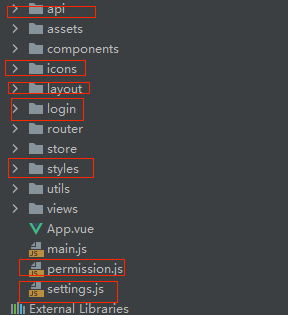

这次优化工作可以总结为三点：

- 做了减法

- 优化部分组和功能的实现逻辑

- 优化部分模块的代码结构

## 目录结构调整



上面标红的部分有的我删除了，有的移到其它目录中的. src 下面的一级目录划分以下结构：

```

```

## 下一步重构计划

### 打包配置

- 升级到 Webpack5. 因为 webpack5 优化项

  构建速度优化

  代码体积优化

  持久化缓存优化

  Module Federation

- 优化 vue.config.js 内容

  1. 因为我们选择使用 脚手架，就是为了省这方面的维护成本，添加的东西越多，意味着要理解的东西也越多，所以我的想法是尽量简化自定义的配置
  
  2. 代理部分的值独立出另外一个文件，因为多人开发的时候，代理这部分是最容易产生冲突的地方